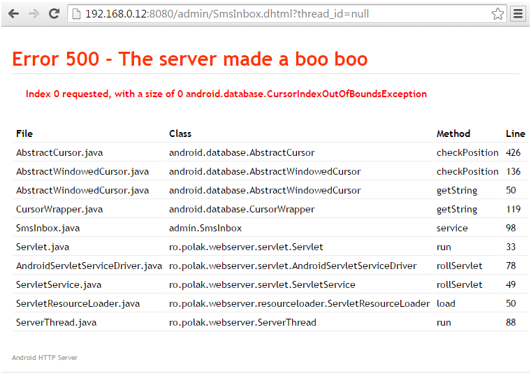

# Android HTTP Server

Small but powerful multithreaded web server written completely in Java SE and then ported to Android.

[](https://travis-ci.org/piotrpolak/android-http-server)
[](https://codecov.io/gh/piotrpolak/android-http-server)
[](https://www.codacy.com/app/piotrpolak/android-http-server)

The server implements most of the HTTP 1.1 specification.
Custom servlet API is used to handle dynamic pages. The API is designed after the official `javax.servlet` API yet it is not compatible.
Dynamic pages support cookies, sessions, file uploads and anything else to build a common web application.

The server can be used as a standalone web server for static body or as a remote application back-office engine that can be accessed from web.

## Key features

* Small footprint, requires no external libraries
* Handles HTTP requests in separate threads
* Supports dynamic pages via Servlets (own specification)
* Support for GET, POST, HEAD methods
* Supports chunked transfer type
* ~~Supports KEEP-ALIVE connections~~
* Full support for mime types (uses Apache like mime.type)
* Supports buffered file upload (multipart requests)
* Exposes compact API for handling sessions
* Supports serving partial body (ranges)

## Building application

The provided Gradle wrapper should be used to build the application:

```bash
./gradlew build
```

## The http subproject and the idea behind it

The `http` subproject is the heart of the application and it is independent on Android platform.

In fact the Android app was just a way to find a more practical use of a yet another standalone HTTP
server implementation.

One of the design goals was to keep it small in size and minimalistic in terms of dependencies -
it does not require any third party library, all HTTP protocol implementation is based on parsing
data read from raw TCP sockets.

Once the `ro.polak.http` package is mature enough it will be released as an independent artifact.

The subproject can be tested in the following way:

```bash
./gradlew :http:clean :http:check
```

The goal is to keep the core well tested and have 90%+ of code covered.

## Running standalone server (CLI)

Standalone server can be used to bundle `http` subproject into a runnable server implementation.
The CLI subproject is also independent on the Android platform. It is not bundled with the main apk.

```bash
./gradlew :cli:bootRun
```

You can also build one "uber-jar" that can be used as a standalone server. To generate an "uber-jar"
you should run:

```bash
./gradlew :cli:fatJar
```

The resulting artifact can then be grabbed from `./cli/build/libs/cli-all.jar`.

You can then run the standalone server on any machine with the following command:

```bash
java -jar ./cli/build/libs/cli-all.jar
```

## Sample code

Hello World servlet

```java
package example;

import ro.polak.http.servlet.HttpServletRequest;
import ro.polak.http.servlet.HttpServletResponse;
import ro.polak.http.servlet.HttpServlet;

public class HelloWorld extends HttpServlet {

    @Override
    public void service(HttpServletRequest request, HttpServletResponse response) {
        response.getWriter().print("Hello World!");
    }
}
```

More examples can be found in [http/src/main/java/example](./http/src/main/java/example).

## Screens


### 500 error page trace


## Sample script to send SMS using wget

If you want to send a real SMS please remove "&test=1" from the POST params.

```bash
SERVER_IP=192.168.1.1; SERVER_PORT=8080; \
    echo "Phone number:"; read TO; echo "Message:"; read MESSAGE; \
    wget -qO- --post-data "to=$TO&message=$MESSAGE&test=1" \
    http://$SERVER_IP:$SERVER_PORT/api/SmsSend.dhtml
```

# Icons

Android HTTP server uses icons from the beautifully designed "Farm-Fresh Web Icons" pack by
FatCow Web Hosting! These icon sets are licensed under a
[Creative Commons Attribution 3.0 License](https://creativecommons.org/licenses/by/3.0/).
