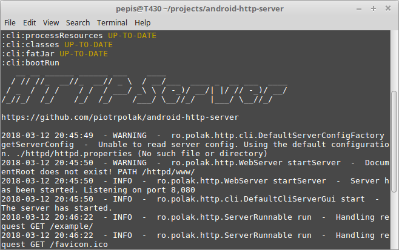
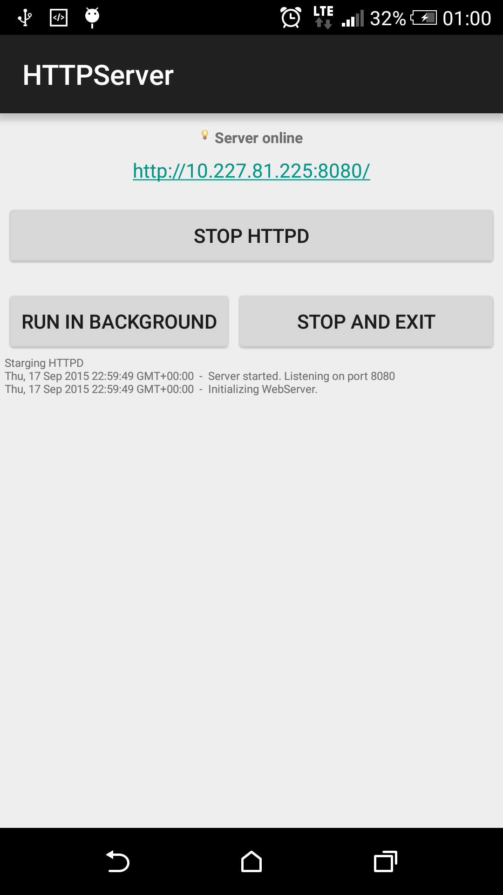
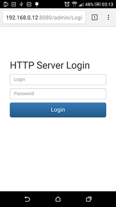
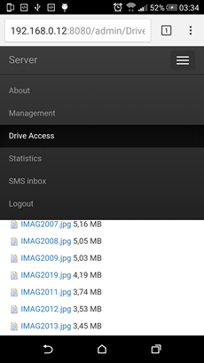
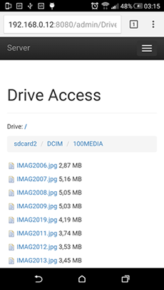
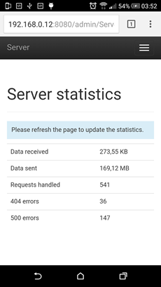
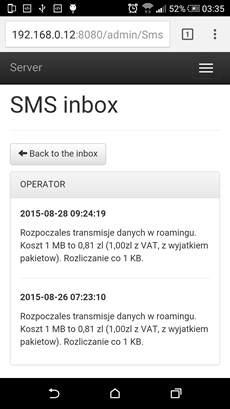
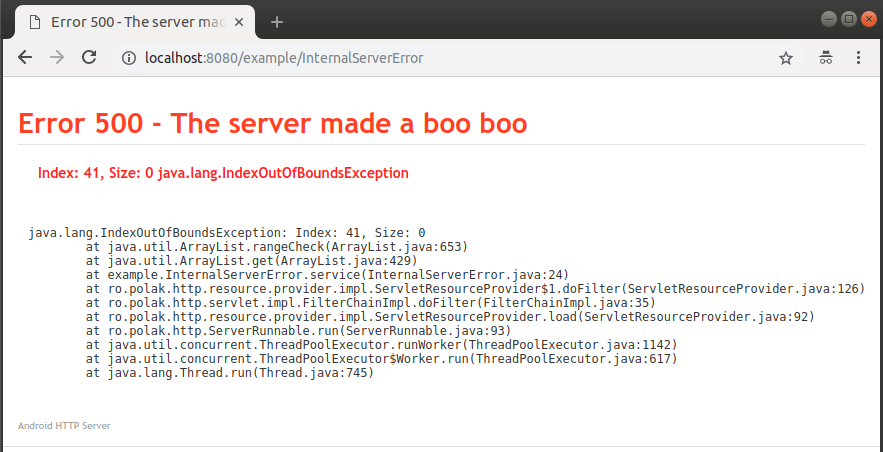

# Android HTTP Server

Small but powerful multithreaded web server written completely in Java SE and then ported to Android.

[](https://codecov.io/gh/piotrpolak/android-http-server)
[](https://www.codacy.com/app/piotrpolak/android-http-server)


The server implements most of the HTTP 1.1 specification and provides custom servlet API that can be
used to handle dynamic pages. The servlet API is designed after the official `javax.servlet` API
yet it is not compatible. Dynamic pages support cookies, sessions, file uploads and anything else
to build a common web application.

* [Key features](#key-features)
* [Building the application](#building-the-application)
    * [Installing Android SDK from command line](#installing-android-sdk-from-command-line)
* [The http subproject and the idea behind it](#the-http-subproject-and-the-idea-behind-it)
* [Mutation testing](#mutation-testing)
* [Running standalone server (CLI)](#running-standalone-server-cli)
* [Demo](#demo)
* [Sample code](#sample-code)
    * [Hello World servlet](#hello-world-servlet)
    * [Request logging filter](#request-logging-filter)
* [Building a deployment descriptor](#building-a-deployment-descriptor)
* [Templating support](#templating-support)
* [Screens](#screens)
* [500 error stack trace in browser](#500-error-page-trace-in-browser)
* [Sample script to send SMS using wget command line utility](#sample-script-to-send-sms-using-wget-command-line-utility)
* [License](#license)

## Key features

* Small footprint, requires no external libraries
* Handles HTTP requests in separate threads
* Provides custom servlets API for generating dynamic content
* Supports GET, POST, HEAD methods (or more, depending on the configuration)
* Supports chunked transfer type
* Provides full support for mime types (uses Apache like mime.type)
* Supports buffered file upload (multipart requests), cookies, persisted sessions
* Supports serving partial body (ranges)
* Can serve static content both from file system and APK resources

## Building the application

The provided Gradle wrapper should be used to build the application:

```bash
./gradlew clean build
```

## Installing Android SDK from command line

When running the full build for the first time you must first install the Android SDK. You might either install it manually
or use the following script that downloads and installs all required dependencies to `~/android-sdk`.

```bash
./installsdk.sh
```

To make things work after you logout and login back, configure the `ANDROID_HOME` environment variable:

```bash
echo "export ANDROID_HOME=~/android-sdk" >> ~/.bashrc && source ~/.bashrc
```

## The http subproject and the idea behind it

The [http](../../tree/master/http/) subproject is the heart of the application and it is
independent on Android platform.

In fact the Android app was just an attempt to find a more practical use of the experimental HTTP
protocol implementation.

One of the design goals was to keep the resulting artifact **small in size** and minimalistic
in terms of dependency on other libraries - **it does not require any third party component**,
all HTTP protocol implementation is based on parsing data read from raw TCP sockets.

Once the [ro.polak.http](../../tree/master/http/src/main/java/) package is mature enough it will be
released as an independent artifact.

The subproject can be tested in the following way:

```bash
./gradlew :http:clean :http:check -PskipAndroidBuild
```

The original package code has been refactored and covered with unit and integration tests.
Code coverage should be kept above 90%.

[](https://codecov.io/gh/piotrpolak/android-http-server)

### Android SDK compatibility issues

All application code is targeted to Java 7. It also compiles for the Android SDK versions < 19
(try with resources is not supported, use
[IOUtilities.closeSilently(closeable)](../../tree/master/http/src/main/java/ro/polak/http/utilities/IOUtilities.java)
in a `finally` block as an alternative when closing streams).

Another compatibility constraint is that `Random` instead of `ThreadLocalRandom` is used for
generating random sequences in [StringUtilities](../../tree/master/http/src/main/java/ro/polak/http/utilities/StringUtilities.java)

## Mutation testing

Mutation tests can be run by executing the following command:

```bash
./gradlew :http:clean :http:pitest -PskipAndroidBuild
```

The results can then be found under `http/build/reports/pitest/ro.polak.http/index.html` and
`http/build/reports/pitest/ro.polak.http/mutation.xml`.

## Running standalone server (CLI)

Standalone server can be used to bundle the `http` subproject into a runnable server implementation.
The CLI subproject is also independent on the Android platform, it is not bundled with the main APK.

```bash
./gradlew :cli:bootRun -PskipAndroidBuild
```

It is also possible to build one "uber-jar" and to use it as a standalone application:

```bash
./gradlew :cli:fatJar -PskipAndroidBuild
```

The resulting artifact can then be grabbed from `./cli/build/libs/cli-all.jar`.

The standalone server jar can be run on any machine with the following command:

```bash
java -jar ./cli/build/libs/cli-all.jar
```

### Overwriting configuration values from command line

```bash
java -jar ./cli/build/libs/cli-all.jar \
    -Dserver.port=8888 \
    -Dserver.static.path=/www/public_html
```

For a complete list of available parameters refer to
[httpd.properties](../../tree/master//app/src/main/assets/conf/httpd.properties).



## Demo

A demo application is automatically deployed to Heroku and can be reached at:

* [https://android-http-server-demo.herokuapp.com/example/](https://android-http-server-demo.herokuapp.com/example/).

Please note the deployed application **does not contain** the *admin* application since that is only
available for Android. See [Procfile](../../tree/master/Procfile) for the deployment description.

## Sample code

### Hello World servlet

```java
package example;

import ro.polak.http.servlet.HttpServletRequest;
import ro.polak.http.servlet.HttpServletResponse;
import ro.polak.http.servlet.HttpServlet;

public class HelloWorld extends HttpServlet {

    @Override
    public void service(HttpServletRequest request, HttpServletResponse response) {
        response.getWriter().print("Hello World!");
    }
}
```

### Request logging filter

```java
package example;

import java.io.IOException;

import ro.polak.http.exception.ServletException;
import ro.polak.http.servlet.Filter;
import ro.polak.http.servlet.FilterChain;
import ro.polak.http.servlet.FilterConfig;
import ro.polak.http.servlet.HttpServletRequest;
import ro.polak.http.servlet.HttpServletResponse;

public class RequestLoggingFilter implements Filter {
    
    private static final Logger LOGGER = Logger.getLogger(RequestLoggingFilter.class.getName());

    @Override
    public void init(FilterConfig filterConfig) throws ServletException {
        // Do nothing
    }

    @Override
    public void doFilter(HttpServletRequest request, HttpServletResponse response,
                         FilterChain filterChain) throws IOException, ServletException {
        
        LOGGER.fine("Handling incoming request " + request.getRequestURL());
        
        filterChain.doFilter(request, response);
    }
}
```

Example servlets can be found in [http/src/main/java/example](../../tree/master/http/src/main/java/example).

A practical use of filters can be checked at
[SecurityFilter.java](../../tree/master/app/src/main/java/admin/filter/SecurityFilter.java) and 
[LogoutFilter.java](../../tree/master/app/src/main/java/admin/filter/LogoutFilter.java) of the
admin application.

## Building a deployment descriptor

[DeploymentDescriptorBuilder](../../tree/master/http/src/main/java/ro/polak/http/configuration/DeploymentDescriptorBuilder.java)
is an API alternative to traditional `web.xml` approach that aims to make servlet mapping building
and filter registration easy. See example code below.

```java
package example;

import java.util.List;
import java.util.regex.Pattern;

import ro.polak.http.configuration.DeploymentDescriptorBuilder;
import ro.polak.http.configuration.ServerConfig;
import ro.polak.http.session.storage.SessionStorage;

class DeploymentDescriptorFactory {
    public List<ServletContextWrapper> buildDeploymentDescriptor(SessionStorage sessionStorage,
                                                    ServerConfig serverConfig) {
        
        return DeploymentDescriptorBuilder.create()
                   .withSessionStorage(sessionStorage)
                   .withServerConfig(serverConfig)
                   .addServletContext()
                       .withContextPath("/example")
                       .addFilter()
                           .withUrlPattern(Pattern.compile("^.*$"))
                           .withUrlExcludedPattern(Pattern.compile("^/(?:Login|Logout)"))
                           .withFilterClass(SecurityFilter.class)
                       .end()
                       .addFilter()
                           .withUrlPattern(Pattern.compile("^/Logout$"))
                           .withFilterClass(LogoutFilter.class)
                       .end()
                       .addServlet()
                           .withUrlPattern(Pattern.compile("^/Index$"))
                           .withServletClass(Index.class)
                       .end()
                       .addServlet()
                           .withUrlPattern(Pattern.compile("^/$"))
                           .withServletClass(Index.class)
                       .end()
                   .end()
                   .build();
    }
}
```

## Serving static contents

Serving static resources is implemented using [DefaultServlet](../../tree/master/http/src/main/java/ro/polak/http/DefaultServlet.java)
- the servlet is automatically registered as the very last element of [DeploymentDescriptorBuilder](../../tree/master/http/src/main/java/ro/polak/http/configuration/DeploymentDescriptorBuilder.java)
acting as a fallback resource.

The actual resource loading is implemented by registering an instance [ResourceProvider](../../tree/master/http/src/main/java/ro/polak/http/resource/provider/ResourceProvider.java)
in the server config.

Currently there are two resource providers implemented 

* File system resources [FileSystemResourceProvider](../../tree/master/http/src/main/java/ro/polak/http/resource/provider/FileSystemResourceProvider.java)
* Android APK resources [AssetResourceProvider](../../tree/master/base/src/main/java/ro/polak/webserver/base/AssetResourceProvider.java)
 
### Sample dummy implementation of a ResourceProvider

```java
package ro.polak.http.resource.provider;

import ro.polak.http.servlet.impl.HttpServletRequestImpl;
import ro.polak.http.servlet.impl.HttpServletResponseImpl;

import java.io.IOException;

public class DummyResourceProvider implements ResourceProvider {

    /**
     * Tells whether this resource provider can load resource for given path.
     */
    @Override
    public boolean canLoad(final String path) {
        return false; // TODO Add some logic
    }

    /**
     * Loads the resource for the given path by copying the stream to the response.getOutputStream().
     */
    @Override
    public void load(final String path,
                     final HttpServletRequestImpl request,
                     final HttpServletResponseImpl response) throws IOException {

        // TODO Load the stream to response.getOutputStream();
    }

    /**
     * Shuts down the resource provider if necessary, usually closes all open resources.
     */
    @Override
    public void shutdown() {
    }
}
```


## Templating support


The following example presents how to integrate [Jtwig](http://jtwig.org/) templating engine.

First you need to add Jtwig dependency in your gradle file:

```groovy
// ...
dependencies {
    // ...
    compile 'org.jtwig:jtwig-core:5.87.0.RELEASE'
}
// ...
```

Then it works out of the box:

```java
package example;

import org.jtwig.JtwigModel;
import org.jtwig.JtwigTemplate;

import ro.polak.http.exception.ServletException;
import ro.polak.http.servlet.HttpServlet;
import ro.polak.http.servlet.HttpServletRequest;
import ro.polak.http.servlet.HttpServletResponse;

public class Templating extends HttpServlet {

    @Override
    public void service(HttpServletRequest request, HttpServletResponse response)
    throws ServletException {
        JtwigTemplate template = JtwigTemplate.inlineTemplate("Hello {{ var }}");
        JtwigModel model = JtwigModel.newModel().with("var", "World");

        template.render(model, response.getOutputStream());
    }
}
```

## Screens









### 500 error page trace in browser



## Sample script to send SMS using wget command line utility

If you want to send a real SMS please remove "&test=1" from the POST params.

```bash
SERVER_IP=192.168.1.1; SERVER_PORT=8080; \
    echo "Phone number:"; read TO; echo "Message:"; read MESSAGE; \
    wget -qO- --post-data "to=$TO&message=$MESSAGE&test=1" \
    http://$SERVER_IP:$SERVER_PORT/api/1.0/sms/send
```

# Icons

Android HTTP server uses icons from the beautifully designed "Farm-Fresh Web Icons" pack by
FatCow Web Hosting! These icon sets are licensed under a
[Creative Commons Attribution 3.0 License](https://creativecommons.org/licenses/by/3.0/).

# License

The project is shared upon [GNU GPLv3 license](LICENSE.txt).

If you are interested in a dedicated commercial license please drop me a line at
`piotr [at] polak [dot] ro`